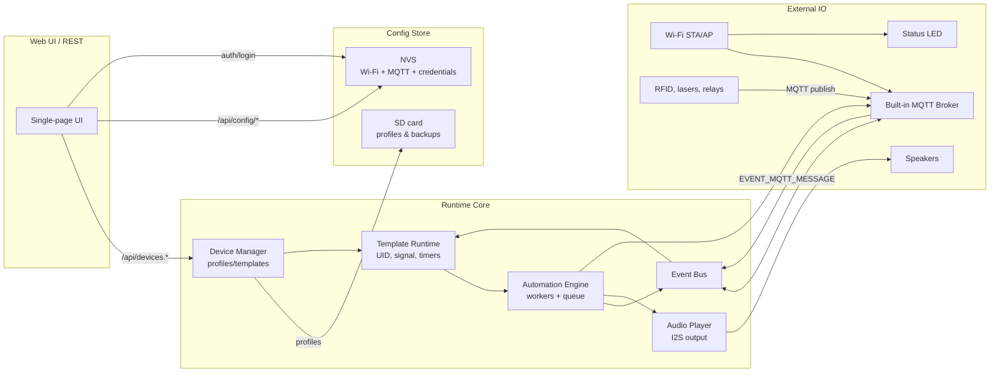

# Broker Architecture

## Overview

The firmware turns an ESP32-S3 with PSRAM + SD card into a stand‑alone automation hub.  
It embeds a Wi‑Fi manager, MQTT broker, device manager with templates, automation
engine, audio player, and Web UI. The system keeps the *active* configuration in
PSRAM, persists backups/profiles on SD, and exposes REST/MQTT interfaces so room
hardware can interact without an external server.

### High-level data flow



## Subsystems

| Component | Location | Responsibility |
|-----------|----------|----------------|
| `network` | `components/network` | Handles STA/AP bring-up, captive portal SSID, DHCP, reconnect loops, pushes Wi-Fi state into `error_monitor`. |
| `config_store` | `components/config_store` | Loads/saves Wi-Fi, MQTT, time and Web credentials in NVS. Provides hashing for Web passwords and bounds for MQTT users (16 entries). |
| `status_led` + `error_monitor` | `components/status_led`, `components/error_monitor` | Drives WS2812 on GPIO 48. Blink red = SD fault/missing, solid red = Wi-Fi down, soft green = Wi-Fi + SD OK. |
| `web_ui` | `components/web_ui` | HTTP server + asset loader. Serves the SPA, REST API, handles login (cookie session), MQTT credential editing, device config import/export, SD browser. |
| `device_manager` | `components/device_manager` | Core config model (profiles, tabs, topics, scenarios, templates). Refactored into `*_core/parse/validate/export` units. Persists every profile to `/sdcard/.dm_profiles`. |
| `template_runtime` | `components/device_manager/template_runtime.c` | Registers runtime state per template (UID validator, signal hold, on_mqtt_event, on_flag, if_condition, interval_task, etc.), feeds automation triggers. |
| `automation_engine` | `components/automation_engine` | Queue + worker tasks. Executes scenario steps (`mqtt_publish`, `audio_play`, `set_flag`, `wait_flags`, `delay`, `event_bus`, loops). |
| `audio_player` | `components/audio_player` | Handles SD track lookup, mp3/wav decode (Helix), I2S playback, pause/seek, amplifier GPIO, integrates with automation. |
| `mqtt_core` | `components/mqtt_core` | Lightweight MQTT 3.1.1 broker (QoS 0/1, retain, will). Enforces ACL per client, authenticates with credentials from config, bridges automation events. Supports 16 simultaneous clients. |
| `event_bus` | `components/event_bus` | Internal publish/subscribe bus linking MQTT, automation, templates, and status endpoints. |
| `main` | `main/` | Bootstraps IDF, initializes subsystems, handles Wi-Fi provisioning, kicks automation + audio + device manager. |

## Configuration lifecycle

1. `app_main` initializes `nvs_flash`, `config_store`, SD card, and the device manager.
2. Active profile is loaded from `/sdcard/.dm_profiles/<id>.bin` into PSRAM.
3. `device_manager` registers all templates via `template_runtime`.
4. Web UI `/api/devices/config` exposes the JSON; `/api/devices/apply` validates and writes back to SD.
5. Profiles not in use stay serialized on SD (reloading them swaps into PSRAM without reboot).

## Automation flow

1. External hardware publishes into MQTT broker (e.g., UID readers, heartbeat sensors).
2. `mqtt_core` authenticates client → ACL check → injects into `event_bus`.
3. `template_runtime` subscribes to relevant events (topic, flag, timers) and triggers automation scenarios.
4. `automation_engine` pushes steps to worker queue. Workers call `mqtt_publish`, `audio_play`, `set_flag`, etc.
5. Audio steps hit `audio_player`, MQTT steps go back to broker, flag steps mutate template state.

## Authentication & recovery

- **Web UI**: Username/password stored in NVS (hashed). Cookie-based sessions with `broker_sid`.
- **MQTT**: Up to 16 `(client_id, username, password)` slots. Each mapped to `mqtt_core` ACL to restrict topics.
- **Reset**: GPIO defined in menuconfig resets Web auth + MQTT user table when pulled low for ~10 s; log prints
  `web auth reset pin triggered`.

## Build & test in CI

GitHub Actions workflow `.github/workflows/ci.yml` performs:

1. Checkout + Python setup.
2. Installs ESP-IDF v5.3.3 (cached between runs).
3. Builds main firmware (`idf.py build`).
4. Builds `tests/device_manager` Unity test app (parses JSON limits, templates).
5. Uploads `.bin/.elf` artifacts.

Run the same locally:

```bash
idf.py set-target esp32s3
idf.py build

cd tests/device_manager
idf.py set-target esp32s3
idf.py build
```

## Future diagram targets

- Extend the Mermaid graph with scenario flows or network topology if you add remote MQTT relays.
- Export as PNG/SVG via VSCode or GitHub’s new diagram rendering when sharing outside the repo.
