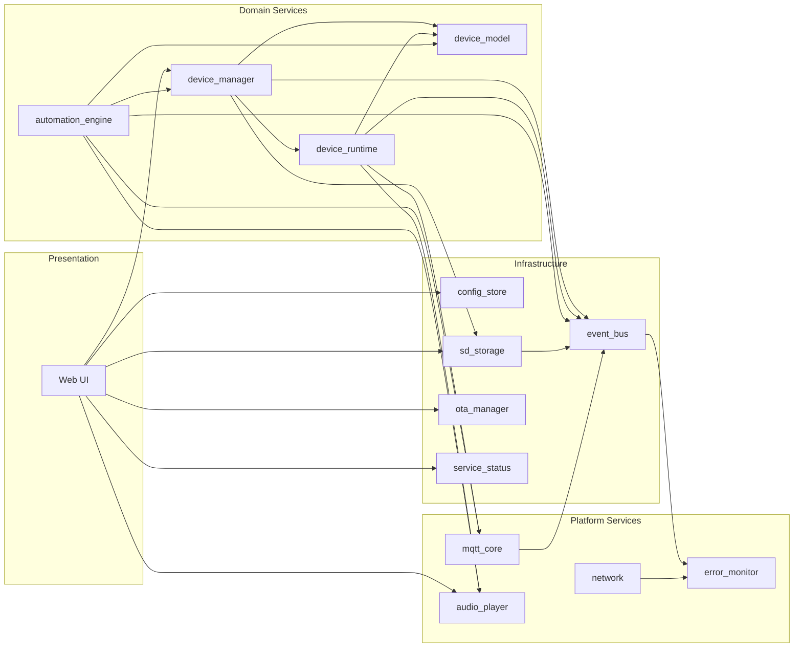

# Broker Architecture

## Overview

`Broker` is an ESP32-S3 based standalone automation hub. It combines:

- Wi-Fi networking
- a built-in MQTT broker
- a Web UI with authentication
- a device configuration system with profiles and templates
- a template runtime
- a scenario automation engine
- an audio playback service
- OTA firmware update support

The firmware is organized as a layered modular system. The current architecture is built around a few practical rules:

- each subsystem has one clear owner
- shared types live in one place
- state changes between services go through explicit APIs or `event_bus`
- optional services should fail in a controlled way instead of panicking the whole device
- presentation logic should not become a second orchestration layer

## Layered View

### 1. Infrastructure

These components provide shared low-level services and do not contain broker-specific business logic.

| Component | Location | Responsibility |
|-----------|----------|----------------|
| `event_bus` | `components/event_bus` | Internal asynchronous message delivery between modules. |
| `config_store` | `components/config_store` | Stores Wi-Fi, MQTT, time and Web credentials in NVS. |
| `sd_storage` | `components/sd_storage` | Single owner of SD mount, card state, filesystem root and card info. |
| `status_led` | `components/status_led` | WS2812 LED control and patterns. |
| `ota_manager` | `components/ota_manager` | OTA upload, partition state, reboot requirement and rollback-aware status. |
| `service_status` | `components/service_status` | Tracks init/start status of optional services for diagnostics and UI. |

### 2. Platform Services

These components own hardware-facing or runtime-facing services.

| Component | Location | Responsibility |
|-----------|----------|----------------|
| `network` | `components/network` | STA/AP lifecycle, IP acquisition, mDNS and NTP. |
| `mqtt_core` | `components/mqtt_core` | Embedded MQTT broker, publish/inject path, session stats. |
| `audio_player` | `components/audio_player` | Audio playback service, decode pipeline, I2S output, playback status and volume. |
| `error_monitor` | `components/error_monitor` | Aggregates health state and drives LED indication. |

### 3. Domain Model

This layer holds shared broker data structures and template metadata.

| Component | Location | Responsibility |
|-----------|----------|----------------|
| `device_model` | `components/device_model` | Shared device types, template types, limits, template registry/factory and common helpers. |

### 4. Domain Services

These components implement broker-specific business logic.

| Component | Location | Responsibility |
|-----------|----------|----------------|
| `device_manager` | `components/device_manager` | Active config, parsing, validation, profiles, storage and JSON import/export. |
| `device_runtime` | `components/device_runtime` | Runtime state for templates and template-driven reactions. |
| `automation_engine` | `components/automation_engine` | Scenario trigger registry, execution queue, workers and flag/context handling. |

### 5. Presentation

| Component | Location | Responsibility |
|-----------|----------|----------------|
| `web_ui` | `components/web_ui` | HTTP server, login/session handling, REST API and embedded SPA assets. |

## High-Level Data Flow


```mermaid
flowchart LR
    subgraph UI[Presentation]
        WEB[Web UI]
    end

    subgraph Infra[Infrastructure]
        NVS[config_store]
        BUS[event_bus]
        SD[sd_storage]
        OTA[ota_manager]
        SVC[service_status]
    end

    subgraph Domain[Domain Services]
        DM[device_manager]
        DR[device_runtime]
        AE[automation_engine]
        MODEL[device_model]
    end

    subgraph Platform[Platform Services]
        NET[network]
        MQTT[mqtt_core]
        AUDIO[audio_player]
        ERR[error_monitor]
    end

    WEB --> DM
    WEB --> NVS
    WEB --> AUDIO
    WEB --> OTA
    WEB --> SD
    WEB --> SVC

    DM --> SD
    DM --> DR
    DM --> MODEL
    DM --> BUS

    DR --> MODEL
    DR --> MQTT
    DR --> AUDIO
    DR --> BUS

    AE --> DM
    AE --> MODEL
    AE --> MQTT
    AE --> AUDIO
    AE --> BUS

    MQTT --> BUS
    SD --> BUS
    BUS --> ERR
    NET --> ERR
```

## Startup Policy

`main/main.c` now separates boot into three practical classes.

Mandatory bootstrap:

- `nvs_flash`
- `ota_manager`
- `config_store`
- `event_bus`
- `service_status`
- `error_monitor`

Deferred-fatal services:

- `network`
- `mqtt_core`
- `web_ui`
- `device_manager`
- `device_runtime`
- `automation_engine`

Optional services:

- `audio_player`

Rules:

- mandatory bootstrap still uses hard failure semantics because the system cannot operate correctly without it
- deferred-fatal services may start in a later bootstrap stage, but failure still makes the product unusable
- optional services initialize and start through tracked wrappers
- failures of optional services are recorded in `service_status`
- audio startup failure is additionally surfaced through `error_monitor`
- deferred-fatal startup is currently implemented by a dedicated product bootstrap task in `main/main.c`

This gives a controlled degraded-startup model without pretending the broker is healthy when core business logic is missing. The policy is already explicit, but the startup mechanism is still procedural rather than a unified startup orchestrator.

## Failure Policy

The system uses four failure classes.

| Class | Meaning | Reaction |
|---|---|---|
| `BOOT_FATAL` | Base startup infrastructure. Without it, the device must not continue normal boot. | Immediate fatal stop |
| `BOOT_DEFERRED_FATAL` | A subsystem may start slightly later or in a separate stage, but if it fails, the product is considered unusable. | Fatal stop after failed deferred/bootstrap stage |
| `BOOT_OPTIONAL` | A subsystem is not required for basic device viability. Degraded mode is allowed. | Log, status update, degraded mode |
| `RUNTIME_FAULT` | Failure of an already running subsystem during normal operation. | Log, status or fault reporting, no panic by default |

### Current Policy Matrix

| Component | Policy | Notes |
|---|---|---|
| `nvs_flash` | `BOOT_FATAL` | Base persistent platform storage |
| `config_store` | `BOOT_FATAL` | Device config is mandatory at boot |
| `event_bus` | `BOOT_FATAL` | Base inter-module signaling |
| `service_status` | `BOOT_FATAL` | Base service observability layer |
| `error_monitor` | `BOOT_FATAL` | Base health and fault reporting |
| `ota_manager` | `BOOT_FATAL` | Boot and update state integrity is mandatory |
| `device_manager` | `BOOT_DEFERRED_FATAL` | Core configuration service of the product |
| `device_runtime` | `BOOT_DEFERRED_FATAL` | Core runtime built from active configuration |
| `automation_engine` | `BOOT_DEFERRED_FATAL` | Core scenario execution layer |
| `network` | `BOOT_DEFERRED_FATAL` | Not part of platform infrastructure, but mandatory for the working product |
| `mqtt_core` | `BOOT_DEFERRED_FATAL` | Not part of platform infrastructure, but mandatory for the working product |
| `web_ui` | `BOOT_DEFERRED_FATAL` | Not part of platform infrastructure, but mandatory for the working product |
| `audio_player` | `BOOT_OPTIONAL` | Degraded mode without audio is acceptable |

### Runtime Fault Policy

The following failures are treated as `RUNTIME_FAULT` by default:

- SD or storage faults
- audio decode or output faults
- HTTP request handler failures
- transient MQTT session or socket failures
- transient network failures after successful boot
- OTA operation rejection or image validation failure while preserving the last valid system state

### Rules

1. `BOOT_FATAL` is reserved for platform infrastructure required to continue boot safely.
2. `BOOT_DEFERRED_FATAL` is used for product subsystems that may start later but are still mandatory for a usable device.
3. `BOOT_OPTIONAL` allows degraded mode and must not panic the system during startup.
4. `RUNTIME_FAULT` must not panic by default unless system integrity is compromised.
5. If an operation cannot be completed safely, the system should reject it and preserve the last valid state instead of terminating abruptly.

## Ownership and Boundaries

### SD Card

Owner:

- `components/sd_storage`

Rules:

- no other component owns mount state
- no other component should implement its own SD lifecycle
- consumers ask `sd_storage` for mount/info/root path only
- `sd_storage` owns its mutex and card-state synchronization

Current users:

- `audio_player`
- `web_ui`
- `device_manager`

Important:

- `sd_storage` no longer depends on `error_monitor`
- SD status is propagated through `event_bus` using `EVENT_CARD_OK` and `EVENT_CARD_BAD`
- storage helpers now fail explicitly on mutex/card-state problems instead of silently assuming a mounted card

### Audio

Owner:

- `components/audio_player`

Public responsibility:

- play/stop/pause/resume/seek
- volume handling
- playback status

Internal structure:

- `audio_player.c` - public facade
- `audio_player_runtime.c` - runtime owner, command queue and reader lifecycle
- `audio_player_decode.c` - reader worker and decode pipeline
- `audio_player_output.c` - I2S and output path
- `audio_player_status.c` - playback status
- `audio_player_volume.c` - volume and NVS persistence

Rules:

- UI and automation should use `audio_player` as a service
- audio control should not be implemented through SD or ad-hoc event logic
- `audio_player` should return init errors to its caller instead of panicking the process during optional startup
- `audio_player_runtime` is the single owner of playback lifecycle and state transitions
- reader execution is an internal worker detail and should not leak through public APIs

### Device Configuration

Owner:

- `components/device_manager`

Public responsibility:

- initialize and hold active config
- lock and unlock access to config
- import and export JSON
- manage profiles
- persist snapshots

Internal boot flow:

- `dm_prepare_buffers()`
- `dm_load_or_create_config()`
- `dm_sync_profiles()`
- `dm_build_runtime()`
- `dm_boot_retry_delay()`

Important boundaries:

- `device_manager` owns config persistence and profile sync
- `device_manager` is not the owner of template runtime execution internals
- runtime logic remains in `device_runtime`
- config-changed notifications are emitted through `event_bus`, not by hidden direct callbacks
- device identity model is `id` + `display_name`; legacy JSON `name` is accepted only as import fallback and should not be exported as a separate semantic field

### Shared Device Types

Owner:

- `components/device_model`

Contains:

- device config types
- scenario step types
- template config types
- template registry and factory
- common limits and copy helpers

Rule:

- shared device and template types go here, not into `device_manager`

### Template Runtime

Owner:

- `components/device_runtime`

Public responsibility:

- initialize runtime service
- rebuild runtime from active config
- expose runtime snapshot API where needed

Internal responsibility:

- UID validator runtime
- signal hold runtime
- MQTT trigger runtime
- flag trigger runtime
- condition runtime
- interval runtime
- sequence runtime

Important boundary:

- `device_runtime` no longer calls `automation_engine` directly
- scenario triggers are passed through `event_bus` using `EVENT_SCENARIO_TRIGGER`

### Scenario Automation

Owner:

- `components/automation_engine`

Responsibility:

- maintain flag and context state
- queue scenario jobs
- execute scenario steps

Important dependencies:

- reads active config from `device_manager`
- uses shared types from `device_model`
- performs side effects through `mqtt_core`, `audio_player` and `event_bus`
- does not own MQTT trigger matching; MQTT-driven scenario selection now lives in `device_runtime` template runtimes such as `on_mqtt_event`

### Web UI

Owner:

- `components/web_ui`

Responsibility:

- HTTP server
- login and session handling
- REST routes
- embedded assets

Important structure:

- routes are registered from a route descriptor table instead of a long manual registration block
- guarded routes pass through one auth gate with per-route role metadata
- startup rolls back cleanly if assets or routes fail to register
- JSON responses for dynamic string content are built through `cJSON` helpers rather than raw `snprintf`

Rules:

- `web_ui` is a presentation layer
- it should use public service APIs from other components
- internal headers from other components should not leak into Web UI logic
- state-changing endpoints must keep auth and origin checks consistent with the session model

## Runtime Lifecycle

### Boot Sequence

`main/main.c` currently performs startup in this order:

1. initialize task watchdog policy
2. `nvs_flash`
3. `ota_manager`
4. OTA boot notification
5. `config_store`
6. `event_bus`
7. `service_status`
8. `error_monitor`
9. initialize optional services
10. start `event_bus`
11. start optional services that initialized successfully
12. create product bootstrap task for deferred-fatal services
13. initialize and start `network`
14. initialize and start `mqtt_core`
15. initialize and start `web_ui`
16. initialize `device_manager`
17. initialize and start `automation_engine`
18. call `ota_manager_notify_system_ready()` after deferred-fatal bootstrap succeeds

Important note:

- startup policy is documented and mostly aligned in code
- the current implementation still uses a procedural bootstrap task plus `abort()` for deferred-fatal failure handling
- this is a working startup scheme, not yet a fully unified startup orchestrator

### Device Manager Bootstrap

`device_manager` boot is intentionally staged:

1. allocate config buffers and defaults
2. load SD-backed backup config or create a default one
3. synchronize active profile metadata
4. initialize `device_runtime`
5. rebuild runtime from the active config

The implementation is still one component, but the internal steps are now explicit and easier to review or extend.

### OTA Lifecycle

`ota_manager`:

1. initializes OTA state early at boot
2. reports current boot and running partition
3. receives upload from Web UI
4. validates and finalizes the image
5. marks reboot as required, but does not reboot by itself
6. after explicit reboot into the new image, waits for healthy startup
7. after healthy startup, system is marked ready for confirm

`/api/ota/status` and `/api/status -> ota` expose `ota.phase` as the main lifecycle field.

Current phases:

- `idle`: no OTA action is active
- `uploading`: image upload and write is in progress
- `reboot_required`: image is installed and explicit reboot is required
- `rebooting`: reboot was requested and restart task is already scheduled
- `verify_wait_ready`: device booted into a rollback-capable image and is waiting for `ota_manager_notify_system_ready()`
- `verify_pending`: system is ready and OTA confirm is pending

Compatibility note:

- legacy boolean fields such as `in_progress`, `pending_verify`, `system_ready` and `reboot_required` are still exposed
- new UI logic should treat `ota.phase` as the canonical lifecycle state

## Event-Based Integration

The event bus is used as the decoupling boundary between services.

Important properties:

- `event_bus_start()` is idempotent and should only ever leave one consumer task active
- producers should check and log `event_bus_post()` failures where loss matters
- service-to-service signaling should prefer events over hidden direct dependencies

Important events:

- `EVENT_MQTT_MESSAGE`
- `EVENT_FLAG_CHANGED`
- `EVENT_DEVICE_CONFIG_CHANGED`
- `EVENT_SCENARIO_TRIGGER`
- `EVENT_CARD_OK`
- `EVENT_CARD_BAD`
- `EVENT_AUDIO_FINISHED`

Examples:

- `mqtt_core` injects MQTT input into `event_bus`
- `device_runtime` reacts to MQTT and flags and posts `EVENT_SCENARIO_TRIGGER`
- `automation_engine` listens for scenario-trigger and config-change events
- `sd_storage` reports SD mount status through card events
- `error_monitor` listens to card events instead of being called directly by storage

## Public APIs

After refactoring, public API surfaces are narrower and closer to real ownership.

### `device_manager`

Public header:

- `components/device_manager/include/device_manager.h`

Public scope:

- config lifecycle
- profile lifecycle
- JSON import and export
- raw profile export

Internal helpers stay private to the component.

### `device_runtime`

Public headers:

- `components/device_runtime/include/dm_runtime_service.h`
- `components/device_runtime/include/dm_template_runtime.h`

Low-level runtime implementation headers are private to the component.

### `web_ui`

Public header:

- `components/web_ui/include/web_ui.h`

Internal HTTP, auth, page and helper headers are private to `web_ui`.

### `automation_engine`

Public header:

- `components/automation_engine/include/automation_engine.h`

Only external control operations remain public. Internal reload and MQTT handling functions are private.

### `service_status`

Public header:

- `components/service_status/include/service_status.h`

This component is intentionally small. It exposes only init/start tracking and status lookup for optional services.

## Current Architecture Strengths

- clear SD ownership
- clear split between config and runtime
- shared model isolated into `device_model`
- `web_ui`, `automation_engine` and `audio_player` are split into smaller modules
- startup policy now distinguishes mandatory bootstrap from optional services
- `service_status` gives explicit visibility into degraded startup
- `event_bus` startup is idempotent
- fewer hidden compile-time dependencies
- narrower public headers
- less direct cross-layer calling

## Known Remaining Tradeoffs

These are visible tradeoffs, not hidden defects.

1. `dm_template_runtime.h` is still a public read-model style API.
   - Used for runtime snapshot visibility.
   - Acceptable, but runtime observability is still exposed as a service surface.

2. `device_manager` still combines several responsibilities.
   - config lifecycle
   - profile management
   - persistence
   - import and export
   - The internal boot split helps, but the component is still broad.

3. `error_monitor` is still closer to a health router than to a full health model.
   - It is useful and clear for current LED behavior.
   - It is not yet a full subsystem health aggregator with severity, latching and timestamps.

4. Optional services now degrade cleanly at startup, but some runtime failure paths are still local to each component.
   - This is better than panic-on-boot.
   - It is not yet a full supervisor model.

5. Startup policy is explicit, but startup mechanics are not fully unified yet.
   - `BOOT_FATAL`, `BOOT_DEFERRED_FATAL` and `BOOT_OPTIONAL` are defined clearly.
   - The current implementation still mixes `ESP_ERROR_CHECK`, tracked optional startup and deferred bootstrap failure via `abort()`.
   - Architecturally this is a solid working scheme, but not yet a closed startup orchestration model.

6. `audio_player` is much cleaner than before, but still not the cleanest systems module in the project.
   - `audio_player_runtime` now owns command routing and reader lifecycle.
   - Reader execution is still implemented as an internal worker task rather than a single-loop playback executor.
   - This is acceptable for the current product stage, but remains an area for future cleanup if playback complexity grows.

## Rules for Future Changes

To keep the architecture stable:

1. Put shared device and template types only into `device_model`.
2. Keep component-internal headers out of `include/`.
3. Do not let `sd_storage` call monitoring or UI modules directly.
4. Do not let `device_runtime` call `automation_engine` directly.
5. Use `event_bus` for inter-service signaling where ownership would otherwise blur.
6. Keep `web_ui` as a presentation layer, not a second orchestration layer.
7. Optional services should return errors to their caller instead of using `ESP_ERROR_CHECK` internally during startup.
8. Service health visible to UI should go through `service_status` or a dedicated health layer, not ad-hoc globals.

## Repository Map

```text
components/
  audio_player/        Audio playback service
  automation_engine/   Scenario orchestration
  config_store/        NVS-backed app config
  device_manager/      Active config, profiles, storage, import/export
  device_model/        Shared device/template types and registry
  device_runtime/      Template runtime execution and state
  error_monitor/       Health aggregation and LED policy
  event_bus/           Internal event transport
  mqtt_core/           Embedded MQTT broker
  network/             Wi-Fi and network service
  ota_manager/         OTA upload, status and reboot lifecycle
  sd_storage/          SD ownership and card state
  service_status/      Optional service init/start status
  status_led/          WS2812 patterns
  web_ui/              HTTP server and SPA API
main/
  main.c               System bootstrap and startup policy
```
