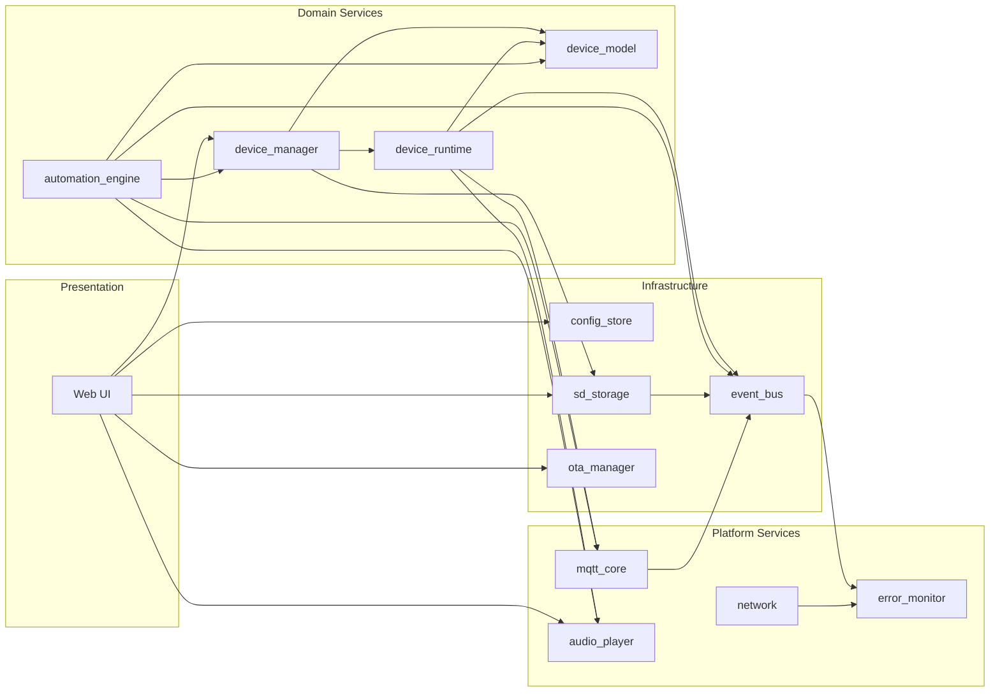

# Broker Architecture

## Overview

`Broker` is an ESP32-S3 based standalone automation hub. It combines:

- Wi-Fi networking
- a built-in MQTT broker
- a Web UI with authentication
- a device configuration system with profiles and templates
- a template runtime
- a scenario automation engine
- an audio playback service
- OTA firmware update support

The firmware is organized as a layered modular system. The main goal of the current architecture is to keep ownership clear:

- one owner for SD card access
- one owner for audio playback
- one owner for device configuration
- one owner for template runtime state
- one owner for scenario orchestration

## Layered View

### 1. Infrastructure

These components provide shared low-level services and do not contain product-specific business logic.

| Component | Location | Responsibility |
|-----------|----------|----------------|
| `event_bus` | `components/event_bus` | Internal asynchronous message delivery between modules. |
| `config_store` | `components/config_store` | Stores Wi-Fi, MQTT, time and Web credentials in NVS. |
| `sd_storage` | `components/sd_storage` | Single owner of SD mount/state/info/root path. |
| `status_led` | `components/status_led` | WS2812 LED control and patterns. |
| `ota_manager` | `components/ota_manager` | OTA upload, partition state, rollback-aware status. |

### 2. Platform Services

These components own hardware-facing runtime services.

| Component | Location | Responsibility |
|-----------|----------|----------------|
| `network` | `components/network` | STA/AP lifecycle, IP acquisition, mDNS, NTP. |
| `mqtt_core` | `components/mqtt_core` | Embedded MQTT broker, publish/inject path, session stats. |
| `audio_player` | `components/audio_player` | Audio playback service, decode pipeline, I2S output, status, volume. |
| `error_monitor` | `components/error_monitor` | Aggregates health state and drives LED indication. |

### 3. Domain Model

This layer holds shared data structures and template metadata.

| Component | Location | Responsibility |
|-----------|----------|----------------|
| `device_model` | `components/device_model` | Shared device types, template types, limits, template registry/factory, common helpers. |

### 4. Domain Services

These components implement broker-specific business logic.

| Component | Location | Responsibility |
|-----------|----------|----------------|
| `device_manager` | `components/device_manager` | Active config, parsing, validation, profiles, storage, JSON import/export. |
| `device_runtime` | `components/device_runtime` | Runtime state for templates and template-driven reactions. |
| `automation_engine` | `components/automation_engine` | Scenario trigger registry, workers, execution queue, flag/context handling. |

### 5. Presentation

| Component | Location | Responsibility |
|-----------|----------|----------------|
| `web_ui` | `components/web_ui` | HTTP server, login/session handling, REST API, embedded SPA assets. |

## High-Level Data Flow


```mermaid
flowchart LR
    subgraph UI[Presentation]
        WEB[Web UI]
    end

    subgraph Infra[Infrastructure]
        NVS[config_store]
        BUS[event_bus]
        SD[sd_storage]
        OTA[ota_manager]
    end

    subgraph Domain[Domain Services]
        DM[device_manager]
        DR[device_runtime]
        AE[automation_engine]
        MODEL[device_model]
    end

    subgraph Platform[Platform Services]
        NET[network]
        MQTT[mqtt_core]
        AUDIO[audio_player]
        ERR[error_monitor]
    end

    WEB --> DM
    WEB --> NVS
    WEB --> AUDIO
    WEB --> OTA
    WEB --> SD

    DM --> SD
    DM --> DR
    DM --> MODEL

    DR --> MODEL
    DR --> MQTT
    DR --> AUDIO
    DR --> BUS

    AE --> DM
    AE --> MODEL
    AE --> MQTT
    AE --> AUDIO
    AE --> BUS

    MQTT --> BUS
    SD --> BUS
    BUS --> ERR
    NET --> ERR
```

## Ownership and Boundaries

### SD Card

Owner:

- `components/sd_storage`

Rules:

- no other component owns mount state
- no other component should implement its own SD lifecycle
- consumers ask `sd_storage` for mount/info/root path only

Current users:

- `audio_player`
- `web_ui`
- `device_manager`

Important:

- `sd_storage` no longer depends on `error_monitor`
- SD status is propagated through `event_bus` using `EVENT_CARD_OK` and `EVENT_CARD_BAD`

### Audio

Owner:

- `components/audio_player`

Public responsibility:

- play/stop/pause/resume/seek
- volume handling
- playback status

Internal structure:

- `audio_player.c` - orchestration/public API
- `audio_player_decode.c` - reader/decode pipeline
- `audio_player_output.c` - I2S/output
- `audio_player_status.c` - playback status
- `audio_player_volume.c` - volume + NVS persistence

Rule:

- UI and automation should use `audio_player` as a service
- audio control should not be implemented through SD or ad-hoc event logic

### Device Configuration

Owner:

- `components/device_manager`

Public responsibility:

- initialize and hold active config
- lock/unlock access to config
- import/export JSON
- manage profiles
- persist snapshots

Important boundary:

- `device_manager` is no longer the owner of runtime template execution
- runtime logic moved to `device_runtime`

### Shared Device Types

Owner:

- `components/device_model`

Contains:

- device config types
- scenario step types
- template config types
- template registry/factory
- common limits and copy helpers

Rule:

- shared device and template types go here, not into `device_manager`

### Template Runtime

Owner:

- `components/device_runtime`

Public responsibility:

- initialize runtime service
- rebuild runtime from active config
- expose runtime snapshot API where needed

Internal responsibility:

- UID validator runtime
- signal hold runtime
- MQTT trigger runtime
- flag trigger runtime
- condition runtime
- interval runtime
- sequence runtime

Important boundary:

- `device_runtime` no longer calls `automation_engine` directly
- scenario triggers are passed through `event_bus` using `EVENT_SCENARIO_TRIGGER`

### Scenario Automation

Owner:

- `components/automation_engine`

Responsibility:

- build trigger registry from active config
- maintain flag/context state
- queue scenario jobs
- execute scenario steps

Important dependencies:

- reads active config from `device_manager`
- uses shared types from `device_model`
- performs side effects through `mqtt_core`, `audio_player` and `event_bus`

### Web UI

Owner:

- `components/web_ui`

Responsibility:

- HTTP server
- login/session handling
- REST routes
- embedded assets

Rule:

- `web_ui` is a presentation layer
- it should use public service APIs from other components
- internal headers from other components should not leak into Web UI logic

## Runtime Lifecycle

### Boot Sequence

`main/main.c` performs the system startup in this order:

1. `nvs_flash`
2. `ota_manager`
3. `config_store`
4. `event_bus`
5. `error_monitor`
6. `network`
7. `mqtt_core`
8. `audio_player`
9. `web_ui`
10. background bootstrap of `device_manager`
11. start `automation_engine`

### Device Manager Bootstrap

`device_manager`:

1. allocates active config in PSRAM
2. loads backup/profile data from SD
3. syncs active profile
4. initializes `device_runtime`
5. rebuilds runtime from the active config

### OTA Lifecycle

`ota_manager`:

1. initializes OTA state early at boot
2. reports current boot/running partition
3. receives upload from Web UI
4. finalizes image
5. marks reboot as required, but does not reboot by itself
6. after explicit reboot into the new image, waits for healthy startup
7. after healthy startup, system is marked ready for confirm

`/api/ota/status` and `/api/status -> ota` expose `ota.phase` as the main lifecycle field.

Current phases:

- `idle`: no OTA action is active
- `uploading`: image upload/write is in progress
- `reboot_required`: image installed, explicit reboot is required
- `rebooting`: reboot was requested and restart task is already scheduled
- `verify_wait_ready`: device booted into a rollback-capable image and is waiting for `ota_manager_notify_system_ready()`
- `verify_pending`: system is ready and OTA confirm is pending

Compatibility note:

- legacy boolean fields such as `in_progress`, `pending_verify`, `system_ready`, and `reboot_required` are still exposed
- new UI logic should treat `ota.phase` as the canonical lifecycle state

## Event-Based Integration

The event bus is used as the decoupling boundary between services.

Important events:

- `EVENT_MQTT_MESSAGE`
- `EVENT_FLAG_CHANGED`
- `EVENT_DEVICE_CONFIG_CHANGED`
- `EVENT_SCENARIO_TRIGGER`
- `EVENT_CARD_OK`
- `EVENT_CARD_BAD`
- `EVENT_AUDIO_FINISHED`

Examples:

- `mqtt_core` injects MQTT input into `event_bus`
- `device_runtime` reacts to MQTT/flags and posts `EVENT_SCENARIO_TRIGGER`
- `automation_engine` listens for scenario trigger and config-change events
- `sd_storage` reports SD mount status through card events
- `error_monitor` listens to card events instead of being called directly by storage

## Public APIs

After refactoring, public API surfaces were narrowed.

### `device_manager`

Public header:

- `components/device_manager/include/device_manager.h`

Public scope:

- config lifecycle
- profile lifecycle
- JSON import/export
- raw profile export

Internal-only helpers are no longer exposed through `include/`.

### `device_runtime`

Public headers:

- `components/device_runtime/include/dm_runtime_service.h`
- `components/device_runtime/include/dm_template_runtime.h`

Low-level runtime implementation headers are private to the component.

### `web_ui`

Public header:

- `components/web_ui/include/web_ui.h`

Internal HTTP/auth/page/helper headers are private to `web_ui`.

### `automation_engine`

Public header:

- `components/automation_engine/include/automation_engine.h`

Only external control operations remain public. Internal reload/MQTT handling functions are now private.

## Current Architecture Strengths

- clear SD ownership
- clear split between config and runtime
- shared model isolated into `device_model`
- `web_ui`, `automation_engine`, and `audio_player` split into smaller modules
- fewer hidden compile-time dependencies
- narrower public headers
- less direct cross-layer calling

## Known Remaining Tradeoffs

These are no longer hidden problems, but they are still deliberate tradeoffs:

1. `dm_template_runtime.h` is still a public read-model style API.
   - Used for runtime snapshot visibility.
   - Acceptable, but it means runtime observability is exposed as a service.

2. `device_manager` still combines multiple responsibilities.
   - config lifecycle
   - profile management
   - persistence
   - export/import
   - This is manageable now, but could be split further later.

3. `error_monitor_report_sd_fault()` still exists.
   - This is not a dependency from `sd_storage`.
   - It is kept for local fault reporting from other services such as `audio_player`.

## Rules for Future Changes

To keep the architecture stable:

1. Put shared device/template types only into `device_model`.
2. Keep component-internal headers out of `include/`.
3. Do not let `sd_storage` call monitoring/UI modules directly.
4. Do not let `device_runtime` call `automation_engine` directly.
5. Use `event_bus` for inter-service signaling where ownership would otherwise blur.
6. Keep `web_ui` as a presentation layer, not a second orchestration layer.

## Repository Map

```text
components/
  audio_player/        Audio playback service
  automation_engine/   Scenario orchestration
  config_store/        NVS-backed app config
  device_manager/      Active config, profiles, storage, export/import
  device_model/        Shared device/template types and registry
  device_runtime/      Template runtime execution/state
  error_monitor/       Health aggregation and LED policy
  event_bus/           Internal event transport
  mqtt_core/           Embedded MQTT broker
  network/             Wi-Fi/AP/STA service
  ota_manager/         OTA upload and status
  sd_storage/          SD ownership and card state
  status_led/          WS2812 patterns
  web_ui/              HTTP server and SPA API
main/
  main.c               System bootstrap
```
